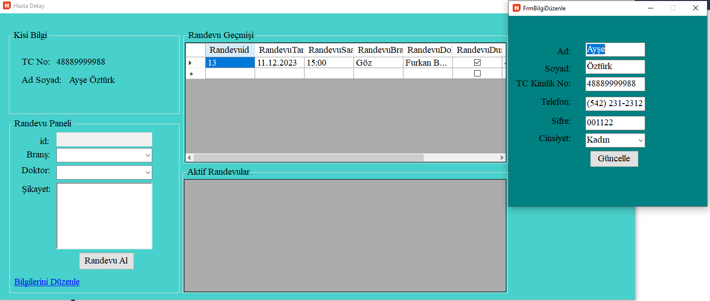
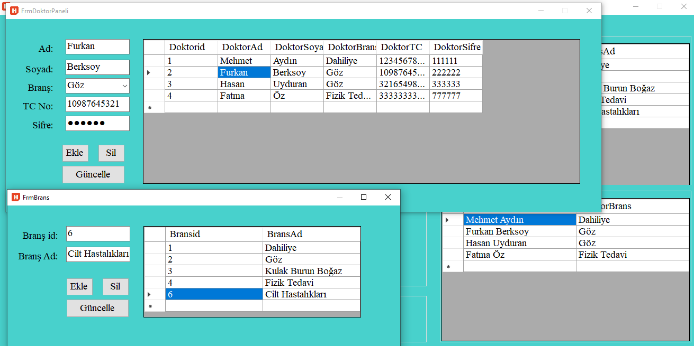

# Hastane_Proje 
Projede hastane randevu kayıt sistemi yapıldı. 
Bu proje .net Framework 4.7.2 ortamında C# ile yazılmıştır.
# Hasta Girişi
* İlk önce giriş ekranında kullanıcı seçilir.

*Hasta Giriş Ekranına TC ve Şifresini girer. Kayıtlı Değilse Üye olur.

* Hasta hesabına girdikten sonra bilgilerini düzenleyebilir.
* Geçmiş randevularını görebilir.
* Randevu isteği oluşturabilir.

* Hasta; branşı, doktoru ve uygun randevu saatini seçer.
* Şikayetini yazarak randevu oluşturur.

# Doktor Girişi
* Doktor Giriş Yapar.                                

* Doktor Kullanıcı Ekranından Randevulari görür ve şikayetlere bakar.

* Doktor Duyuruları görebilir.
* Bilgilerini Düzenleyebilir.

# Sekreter Girişi
* Sekreter Giriş Yapar.                                 

* Sekreter, Branşları ve Doktorları görebilir.
* Duyuru Oluşturabilir.
* Randevu Oluşturabilir.

* Doktor Ekle, sil ve güncelleyebilir.
* Brans Ekleyebilir.

* Randevu Listesini görebilir.

